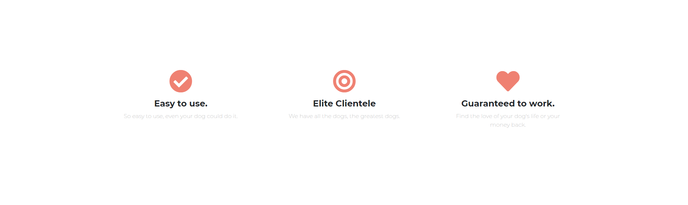

# TinDog Website

Reactive clone of Tinder created using Bootstrap 5. The Bootstrap components used are: The navbar, carousel and card deck. Part of the 6th and 7th sections of the Udemy course "The Complete Web Development Bootcamp".

## Screenshots

